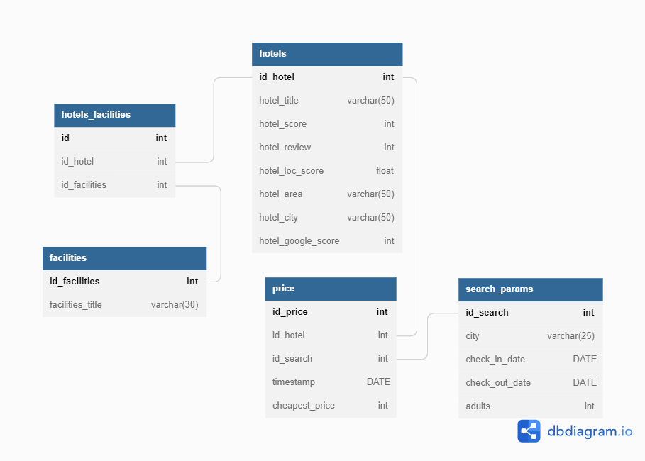

## BOOKING scrapping 
### data mining project for ITC
<p align="center">
</p>

> Finding - Parsing - Analysis

This program parses booking.com by creating  link according to transmitted request date. 
<br>Parsing page, getting important information about hotel. Save it to *.csv file. 
Program made by Kseniia Konoshko, Anna Lelchuk, Alexey Konev during ITC june 2022 Data Science cohort.

### How to run it
- Download __*.zip__ file
- Unzip it at any suitable folder
- Install all libs from __requirements.txt__
- Make sure you pass as CLI argument "-p <i>\<your mysql password></i>"
- Run __main.py__
- That's all
```bash
pip install -r requirements.txt
python main.py -p MYSQL_PASSWORD
```
### Structure of files
- __[venv]__ - environment folder
- __conf__ - configuration file
- __requirements.txt__ - file list off all needed modules
- __main__ - primary startup file
- __get*__ and __create*__ supporting files
### Main library used
- modules __requests__  gets response from site
- module __bs4 (Beautiful Soup)__ is probably the best library to parse information from html
- module __re__ consists most popular regular expressions 
- module __pymysql__ performs actions on a database (create, populate)
- module __argparse__ collects arguments from CLI

### License
Totally __FREE__ as Open-source. 
But it is advisable to use (c) ITC by Kseniia Konoshko, Anna Lelchuk, Alexey Konev
### Functionality of functions
Functions are broken down to files. Each file combines logically connected functionality.

| *File*      | *Function*             | *What do and return*                                                                                                                                                                |
|-------------|------------------------|-------------------------------------------------------------------------------------------------------------------------------------------------------------------------------------|
| main        | main                   | Acts as an orchestrator to program functions. Calls different functions to get CLI apguments, generate urls, scrap data, write to the DB.                                           |
| main        | parse_cli              | Parses arguments from CLI                                                                                                                                                           |
| create_DB   | create_DB              | Checks if DB exists, if not creates database                                                                                                                                        |
| create_DB   | create_db_tables       | Creates db tables                                                                                                                                                                   |
| scrap_data  | scrap_facilities       | Scraps hotel page and gets different facilities                                                                                                                                     |
| scrap_data  | scrape_hotel           | Scrap part of soup to get hotel data from the main page: hotel_title, hotel_area, hotel_city, price, hotel_score, hotel_review, url                                                 |
| api         | api                    | Uses Google search engine API to get information on number of searches done in google for each hotel                                                                                |
| write_to_db | write_to_db            | Fill database with hotel details                                                                                                                                                    |
| write_to_db | write_facilities_to_DB | Fill database with hotel facilities                                                                                                                                                 |
| get_urls    | *create_url*           | Function create one url with city, country, check in date and check out date, number of page.<br/>**return:** url                                                                   |
| get_urls    | *get_urls*             | Function generate all pages of the same search<br/>**return:** list of urls of all pages in the search                                                                              |
| get_urls    | *get_total_hotel_nums* | Function parse on the url amd find number of all hotels according to transmitted request date. Use this value to create offset number.<br/>**return:** integer number of all hotels |
*in italic* - supporting functions

### DB info
#### DB ERD


#### Table "hotels"
| column_name        | Description                                      |
|--------------------|--------------------------------------------------|
| id_hotel           | Hotel id (Primary key)                           |
| hotel_title        | Hotel name                                       |
| hotel_score        | Rating of hotel                                  |
| hotel_review       | Number of reviews                                |
| hotel_loc_score    | Rating of hotel location                         |
| hotel_area         | Hotel area                                       |
| hotel_city         | City                                             |
| hotel_google_score | Number of searches done in google for each hotel |

#### Table "search_params"
| column_name    | Description                  |
|----------------|------------------------------|
| id_search      | Search id (Primary key)      |
| city           | City in the search           |
| check_in_date  | Check-in-date in the search  |
| check_out_date | Check-out-date in the search |
| adults         | Number of adults travelling  |

#### Table "price"
| column_name    | Description                         |
|----------------|-------------------------------------|
| id_price       | Price id (Primary key)              |
| id_hotel       | Hotel id (Foreign key)              |
| id_search      | Search id (Foreign key)             |
| timestamp      | Timestamp of when the search is run |
| cheapest_price | Lowest price each hotel offers      |

#### Table "facilities"
| column_name      | Description                        |
|------------------|------------------------------------|
| id_facilities    | ID of hotel facility (Primary key) |
| facilities_title | Name of hotel facility             |

#### Table "hotel_facilities"
| column_name    | Description                        |
|----------------|------------------------------------|
| id             | Lines counter                      |
| id_hotel       | Hotel id (Foreign key)             |
| id_facilities  | ID of hotel facility (Foreign key) |

