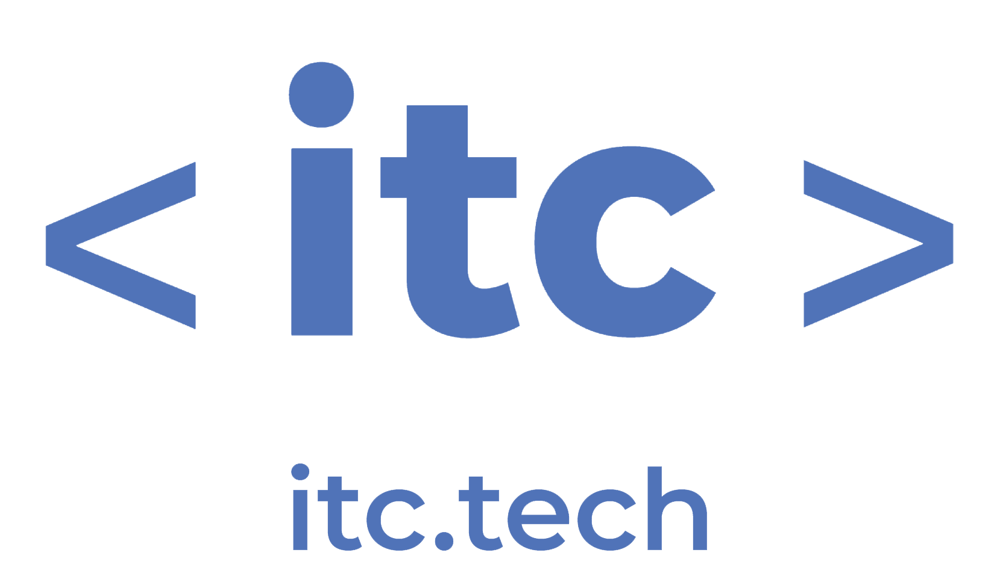

## BOOKING scrapping 
### data mining project for ITC
<p align="center">
</p>

> Finding - Parsing - Analysis

This program parsing booking.com. By creating  link according to transmitted request date. Parsing page, getting important information about hotel. Save it to *.csv file. Programe made by Kseniia Konoshko, Anna Lelchuk, Alexey Konev during ITC june 2022 Data Science cohort.

### How to run it
- Download __*.zip__ file
- Unzip it at any suitable folder
- Install all libs from __requirements.txt__
- Run __main.py__
- That's all
```bash
pip install -r requirements.txt
python main.py
```
### Structure of files
- __[venv]__ - environment folder
- __conf__ - configuration file
- __requirements.txt__ - file list off all needed librarys 
- __main__ - primary startup file
- __get*__ and __create*__ supporting files
### Main library used
- modules __requests__ and __grequest__ helps to get responce from site
- module __bs4 (Beautiful Soup)__ is probably the best library to parse information from html
- module __re__ consists most popular regular expresions 

### License
Totally __FREE__ as Open-source. 
But it is advisable to use (c) ITC by Kseniia Konoshko, Anna Lelchuk, Alexey Konev
### Wanna be as professional as we are ?
| *Source*            | _Link_                                   |
|---------------------|------------------------------------------|
| **ITC**             | <https://www.itc.tech>                   |
| Udemy               | <https://www.udemy.com/topic/python>     |
| Google Python class | <https://developers.google.com/edu/python> |